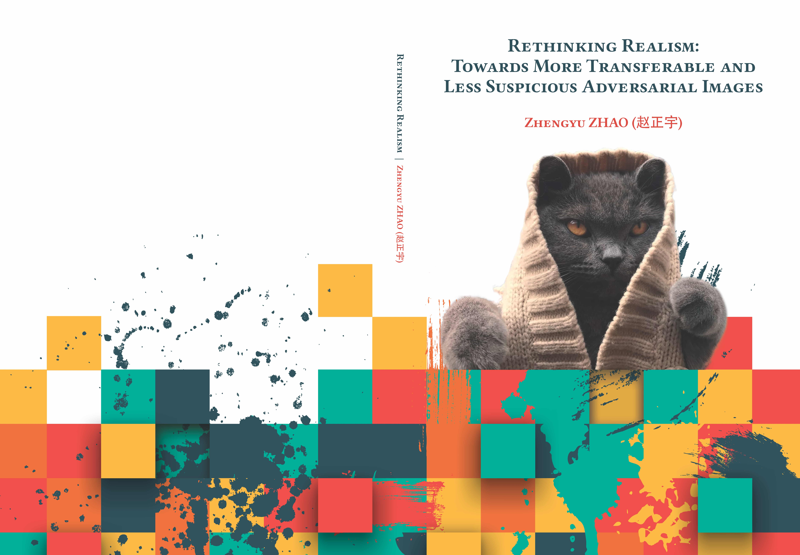
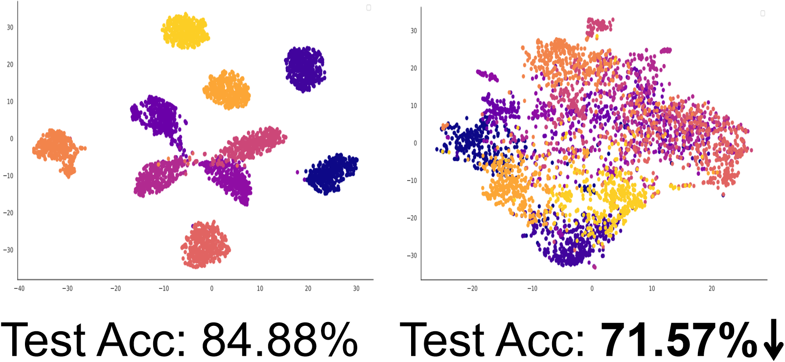
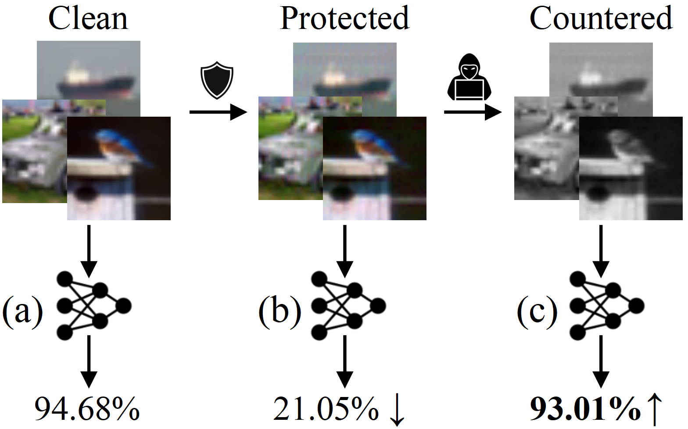
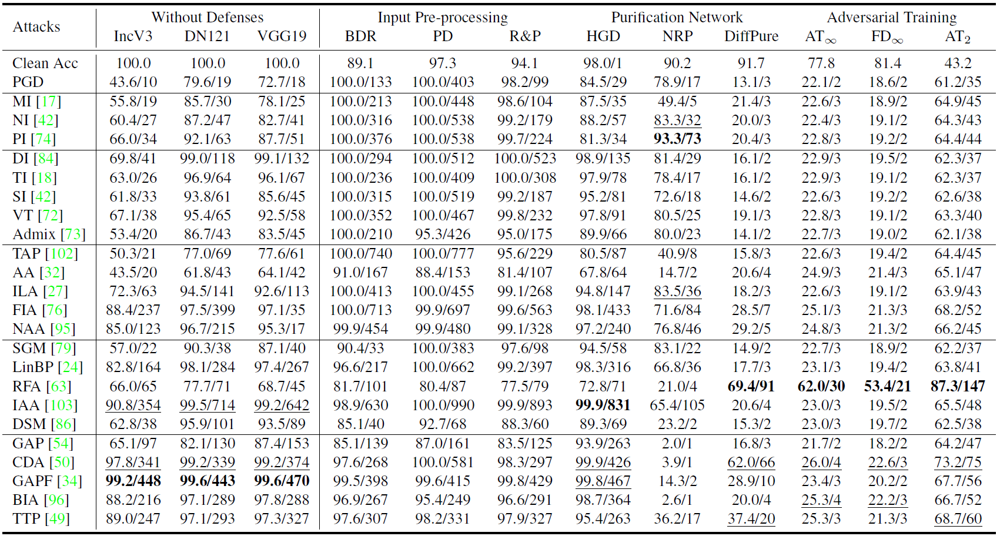
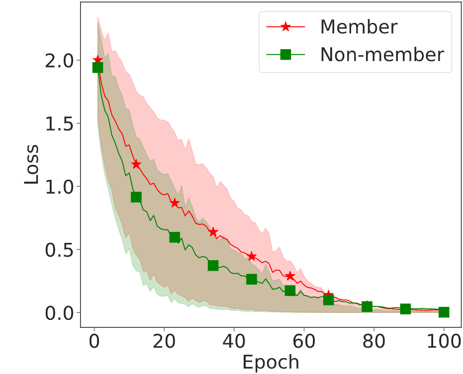
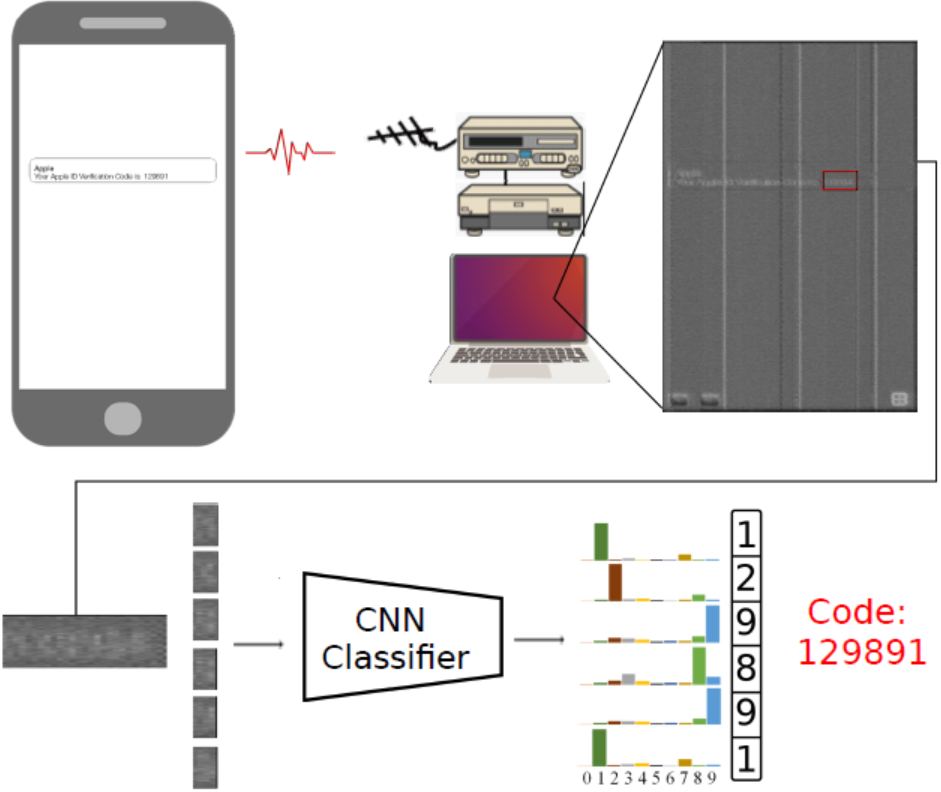
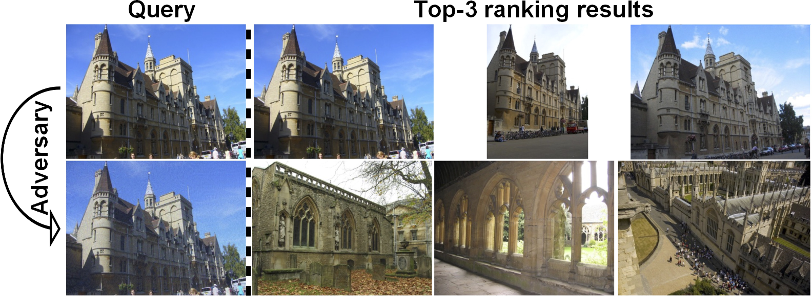
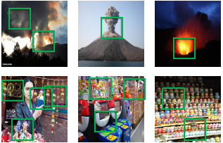
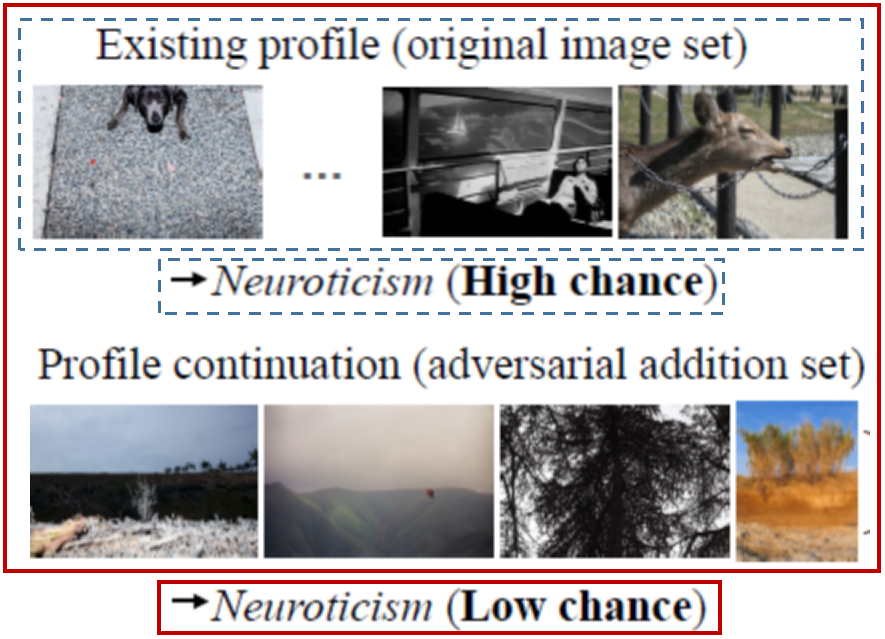

## About Me
I am a postdoc at [CISPA Helmholtz Center for Information Security](https://cispa.de/en/about), Germany, working with [Prof. Michael Backes](https://cispa.de/en/about/director-page) and [Dr. Yang Zhang](https://yangzhangalmo.github.io/).
I received my PhD from [Radboud University](https://www.ru.nl/english/), The Netherlands, under the supervision of [Prof. Martha Larson](https://www.ru.nl/english/people/larson-m/).
My general research interest is <strong>Machine Learning Security & Privacy</strong>; Most of my work has concentrated on analyzing the vulnerability of deep neural networks to various security (e.g. adversarial example and data poisoning) and privacy (e.g. membership inference) attacks.

I will be joining Xi'an Jiaotong University (XJTU, China) as a tenure-track research faculty (Associate Professor) in the Faculty of Electronic and Information Engineering, starting in the fall of 2023. 
If you are interested in doing a PhD/Master in AI Security and Privacy, please reach out! A strong background in machine learning, cyber security, or a related field is a plus.

## News
- **02/2023** I am an [Outstanding Reviewer](https://bmvc2022.org/people/reviewers/) of <strong>AISTATS 2023</strong>!
- **11/2022** I am an [Outstanding Reviewer](https://bmvc2022.org/people/reviewers/) of <strong>BMVC 2022</strong>!
- **07/2022** I will serve as a Senior Program Committee (SPC) Member for <strong>AAAI 2023</strong>!
- **02/2022** I successfully defend my PhD dissertation!
- **12/2021** I join [CISPA Helmholtz Center for Information Security](https://cispa.de/en) as a postdoc!
- **10/2021** Check out [a curated list of events on AI Security & Privacy](https://github.com/ZhengyuZhao/AI-Security-and-Privacy-Events)!
- **05/2021** I participate in the [Doctoral Consortium](https://cvpr2021.thecvf.com/node/46) of <strong>CVPR 2021</strong>!
- **08/2020** I am an [Outstanding Reviewer](https://www.bmvc2020-conference.com/people/reviewers/) of <strong>BMVC 2020</strong>!
- **07/2020** We are organizing the 3rd edition of [Pixel Privacy Task](https://multimediaeval.github.io/editions/2020/tasks/pixelprivacy/) at <strong>MediaEval Benchmark 2020</strong>!

<h2 id="publications" style="margin: 2px 0px -15px;">Publications <temp style="font-size:15px;">[</temp><a href="https://scholar.google.com/citations?user=pC8KpPMAAAAJ&hl=en" target="_blank" style="font-size:15px;">Google Scholar</a><temp style="font-size:15px;">]</temp><temp style="font-size:15px;">[</temp><a href="https://dblp.org/pid/58/10770-1.html" target="_blank" style="font-size:15px;">DBLP</a><temp style="font-size:15px;">]</temp></h2>

<ol class="bibliography">
<li>

  

    
            <abbr class="badge">PhD Thesis</abbr>
  

  

      
<a href="https://repository.ubn.ru.nl/handle/2066/245409">Rethinking Realism: Towards More Transferable and Less Suspicious Adversarial Images</a>

      
<strong>Zhengyu Zhao</strong>

      
<em>Radboud University, 2022.</em>
      

  

</li>
 

<li>

  

    
            <abbr class="badge">ICLR</abbr>
  

  

      
<a href="https://openreview.net/forum?id=zKvm1ETDOq">Is Adversarial Training Really a Silver Bullet for Mitigating Data Poisoning?</a>

      
Rui Wen, <strong>Zhengyu Zhao</strong>, Zhuoran Liu, Michael Backes, Tianhao Wang, Yang Zhang

      
<em>International Conference on Learning Representations <strong>(ICLR)</strong>, 2023.</em> <strong>(Spotlight, top 8%)</strong>
      

    

      <a href="https://anonymous.4open.science/r/INF-C277/README.md" class="btn btn-sm z-depth-0" role="button" target="_blank" style="font-size:12px;">Code</a>
    

  

</li>  
 
  
<li>

  

    
            <abbr class="badge">arXiv</abbr>
  

  

      
<a href="https://arxiv.org/abs/2301.13838">Image Shortcut Squeezing: Countering Perturbative Availability Poisons with Compression</a>

      
Zhuoran Liu, <strong>Zhengyu Zhao</strong>, Martha Larson

      
<em><strong>arXiv</strong>, 2023.</em>
      

    

      <a href="https://github.com/liuzrcc/ImageShortcutSqueezing" class="btn btn-sm z-depth-0" role="button" target="_blank" style="font-size:12px;">Code</a>
    

  

</li>  
   
  
<li>

  

    
            <abbr class="badge">arXiv</abbr>
  

  

      
<a href="https://arxiv.org/abs/2211.09565">Towards Good Practices in Evaluating Transfer Adversarial Attacks</a>

      
<strong>Zhengyu Zhao*</strong>, Hanwei Zhang*, Renjue Li*, Ronan Sicre, Laurent Amsaleg, Michael Backes

      
<em><strong>arXiv</strong>, 2022.</em>
      

    

      <a href="https://github.com/ZhengyuZhao/TransferAttackEval" class="btn btn-sm z-depth-0" role="button" target="_blank" style="font-size:12px;">Code</a>
    

  

</li>  
   
  
<li>

  

    
            <abbr class="badge">CCS</abbr>
  

  

      
<a href="https://arxiv.org/abs/2208.14933">Membership Inference Attacks by Exploiting Loss Trajectory</a>

      
Yiyong Liu, <strong>Zhengyu Zhao</strong>, Michael Backes, Yang Zhang

      
<em>ACM Conference on Computer and Communications Security <strong>(CCS)</strong>, 2022.</em>
      

    

      <a href="https://github.com/DennisLiu2022/Membership-Inference-Attacks-by-Exploiting-Loss-Trajectory" class="btn btn-sm z-depth-0" role="button" target="_blank" style="font-size:12px;">Code</a>
      <a href="https://zhengyuzhao.github.io/" class="btn btn-sm z-depth-0" role="button" target="_blank" style="font-size:12px;">Video</a>
    

  

</li>
  
  
<li>

  

    
            <abbr class="badge">NeurIPS</abbr>
  

  

      
<a href="https://arxiv.org/abs/2012.11207">On Success and Simplicity: A Second Look at Transferable Targeted Attacks</a>

      
<strong>Zhengyu Zhao</strong>, Zhuoran Liu, Martha Larson

      
<em>Neural Information Processing Systems <strong>(NeurIPS)</strong>, 2021.</em>
      

    

      <a href="https://github.com/ZhengyuZhao/Targeted-Tansfer" class="btn btn-sm z-depth-0" role="button" target="_blank" style="font-size:12px;">Code</a>
      <a href="https://nips.cc/virtual/2021/poster/26087" class="btn btn-sm z-depth-0" role="button" target="_blank" style="font-size:12px;">Video</a>
      <a href="https://zhuanlan.zhihu.com/p/512550358" class="btn btn-sm z-depth-0" role="button" target="_blank" style="font-size:12px;">中文解读</a>
      <a href="https://ml.cs.tsinghua.edu.cn/ares-bench/#/leaderboard" class="btn btn-sm z-depth-0" role="button" target="_blank" style="font-size:12px;">Rank Top-1 on ARES Leaderboard</a>
    

  

</li>
 
  
<li>

  

    
            <abbr class="badge">BMVC</abbr>
  

  

      
<a href="https://arxiv.org/abs/2011.06690">Adversarial Image Color Transformations in Explicit Color Filter Space</a>

      
<strong>Zhengyu Zhao</strong>, Zhuoran Liu, Martha Larson

      
<em>Extended journal version, 2021.</em>
      

    

      <a href="https://github.com/ZhengyuZhao/ACE/tree/master/Journal_version" class="btn btn-sm z-depth-0" role="button" target="_blank" style="font-size:12px;">Code</a>
      <a href="https://www.bmvc2020-conference.com/conference/papers/paper_0099.html" class="btn btn-sm z-depth-0" role="button" target="_blank" style="font-size:12px;">Video</a>
      <a href="https://www.bmvc2020-conference.com/assets/papers/0099.pdf" class="btn btn-sm z-depth-0" role="button" target="_blank" style="font-size:12px;">BMVC 2020 version</a>
    

  

</li> 
   
  
<li>

  

    
            <abbr class="badge">NDSS</abbr>
  

  

      
<a href="https://arxiv.org/abs/2011.09877">Screen Gleaning: A Screen Reading TEMPEST Attack on Mobile Devices Exploiting an Electromagnetic Side Channel</a>

      
Zhuoran Liu, Niels Samwel, Léo Weissbart, <strong>Zhengyu Zhao</strong>, Dirk Lauret, Lejla Batina, Martha Larson

      
<em>Network and Distributed System Security Symposium <strong>(NDSS)</strong>, 2021.</em>
      

    

      <a href="https://github.com/cescalab/screen_gleaning" class="btn btn-sm z-depth-0" role="button" target="_blank" style="font-size:12px;">Code</a>
      <a href="https://www.youtube.com/watch?v=qEXwe58IVFc" class="btn btn-sm z-depth-0" role="button" target="_blank" style="font-size:12px;">Video</a>
    

  

</li>
 

<li>

  

    
            <abbr class="badge">CVPR</abbr>
  

  

      
<a href="https://arxiv.org/abs/1911.02466">Towards Large yet Imperceptible Adversarial Image Perturbations with Perceptual Color Distance</a>

      
<strong>Zhengyu Zhao</strong>, Zhuoran Liu, Martha Larson

      
<em>IEEE Conference on Computer Vision and Pattern Recognition <strong>(CVPR)</strong>, 2020.</em>
      

    

      <a href="https://github.com/ZhengyuZhao/PerC-Adversarial" class="btn btn-sm z-depth-0" role="button" target="_blank" style="font-size:12px;">Code</a>
      <a href="https://www.youtube.com/watch?v=2j74B_9VaJ8" class="btn btn-sm z-depth-0" role="button" target="_blank" style="font-size:12px;">Video</a>
    

  

</li>
 

<li>

  

    
            <abbr class="badge">ICMR</abbr>
  

  

      
<a href="https://arxiv.org/abs/1901.10332">Who's Afraid of Adversarial Queries? The Impact of Image Modifications on Content-based Image Retrieval</a>

      
Zhuoran Liu, <strong>Zhengyu Zhao</strong>, Martha Larson

      
<em>ACM International Conference on Multimedia Retrieval <strong>(ICMR)</strong>, 2019.</em>
      

    

      <a href="https://github.com/liuzrcc/PIRE" class="btn btn-sm z-depth-0" role="button" target="_blank" style="font-size:12px;">Code</a>
    

  

</li>  
 
  
<li>

  

    
            <abbr class="badge">ACM MM</abbr>
  

  

      
<a href="https://arxiv.org/abs/1807.08624">From Volcano to Toyshop: Adaptive Discriminative Region Discovery for Scene Recognition</a>

      
<strong>Zhengyu Zhao</strong>, Martha Larson

      
<em>ACM International Conference on Multimedia <strong>(ACM MM)</strong>, 2018.</em>
      

    

      <a href="https://github.com/ZhengyuZhao/Adi-Red-Scene" class="btn btn-sm z-depth-0" role="button" target="_blank" style="font-size:12px;">Code</a>
      <a href="https://dl.acm.org/citation.cfm?id=3351169" class="btn btn-sm z-depth-0" role="button" target="_blank" style="font-size:12px;">Reproducibility companion paper at <strong>ACM MM</strong> 2019</a>
    

  

</li>
<!--   -->

<!-- <li>

  

    
            <abbr class="badge">UMAP</abbr>
  

  

      
<a href="https://dl.acm.org/doi/10.1145/3450613.3456832">Pivoting Image-based Profiles Toward Privacy: Inhibiting Malicious Profiling with Adversarial Additions</a>

      
Zhuoran Liu, <strong>Zhengyu Zhao</strong>, Martha Larson

      
<em>ACM Conference on User Modeling, Adaptation and Personalization <strong>(UMAP)</strong>, 2021.</em>
      

    

      <a href="https://github.com/liuzrcc/Image-Set-Profile-Pivot" class="btn btn-sm z-depth-0" role="button" target="_blank" style="font-size:12px;">Code</a>
    

  

</li>
  -->

</ol>

## Services

<h4 style="margin:0 10px 0;">Organization Committee</h4>

<ul style="margin:0 0 5px;">
  <li>Poster Session Co-Chair, <a href="https://2019.acmmm.org/index.html"><autocolor>ACM International Conference on Multimedia (ACM MM) 2019</autocolor></a></li>
  <li>Task Co-Organizer of <a href="https://multimediaeval.github.io/editions/2020/tasks/pixelprivacy/">Pixel Privacy</a> (2018-2020) and <a href="http://www.multimediaeval.org/mediaeval2019/multimediasatellite/">Multimedia Satellite</a> (2018, 2019), <a href="https://multimediaeval.github.io/"><autocolor>Multimedia Evaluation Benchmark (MediaEval)</autocolor></a></li>
</ul>

<!-- <h4 style="margin:0 10px 0;">Area Chair</h4>

<ul style="margin:0 0 5px;">
  <li><a href="https://aistats.org/aistats2023/"><autocolor>International Conference on Artificial Intelligence and Statistics (AISTATS) 2023</autocolor></a></li>
</ul> -->

<h4 style="margin:0 10px 0;">Conference Senior Program Committee/Area Chair</h4>

<ul style="margin:0 0 5px;">
  <li><a href="https://aaai.org/Conferences/AAAI-23/"><autocolor>AAAI Conference on Artificial Intelligence (AAAI) 2023</autocolor></a></li>
</ul>

<h4 style="margin:0 10px 0;">Conference Program Committee</h4>

<ul style="margin:0 0 5px;">
  <li><a href="https://iclr.cc/Conferences/2023"><autocolor>International Conference on Learning Representations (ICLR) 2023</autocolor></a></li>
  <li><a href="http://cvpr2023.thecvf.com/"><autocolor>IEEE/CVF Conference on Computer Vision and Pattern Recognition (CVPR) 2022-2023</autocolor></a></li>
  <li><a href="https://iccv2023.thecvf.com/"><autocolor>IEEE International Conference on Computer Vision (ICCV) 2023</autocolor></a></li>
  <li><a href="https://eccv2022.ecva.net/"><autocolor>European Conference on Computer Vision (ECCV) 2022</autocolor></a></li>
  <li><a href="https://bmvc2022.org/"><autocolor>British Machine Vision Conference (BMVC) 2020-2022</autocolor></a></li>
<!--   <li><a href="https://neurips.cc/Conferences/2022"><autocolor>Annual Conference on Neural Information Processing Systems (NeurIPS) 2020-2022</autocolor></a></li> -->
<!--   <li><a href="https://icml.cc/Conferences/2022"><autocolor>International Conference on Machine Learning (ICML) 2021-2022</autocolor></a></li> -->
  <li><a href="https://aaai.org/Conferences/AAAI-23/"><autocolor>AAAI Conference on Artificial Intelligence (AAAI) 2022</autocolor></a></li>
  <li><a href="https://aistats.org/aistats2023/"><autocolor>International Conference on Artificial Intelligence and Statistics (AISTATS) 2023</autocolor></a></li>
  <li><a href="https://facctconference.org/2022/"><autocolor>ACM Conference on Fairness, Accountability, and Transparency (FAccT) 2022</autocolor></a></li>

<!--   <li><a href="https://ijcai-22.org/"><autocolor>International Joint Conference on Artificial Intelligence (IJCAI) 2021-2022</autocolor></a></li> -->
<!--   <li><a href="https://2022.acmmm.org/"><autocolor>ACM International Conference on Multimedia (MM) 2021-2022</autocolor></a></li>   -->
</ul>

<h4 style="margin:0 10px 0;">Journal Reviewer</h4>

<ul style="margin:0 0 20px;">
  <li><a href="https://signalprocessingsociety.org/publications-resources/ieee-transactions-information-forensics-and-security"><autocolor>IEEE Transactions on Information Forensics and Security (TIFS)</autocolor></a></li>
  <li><a href="https://www.sciencedirect.com/journal/pattern-recognition"><autocolor>Pattern Recognition (PR)</autocolor></a></li>
  <li><a href="https://onlinelibrary.wiley.com/journal/1098111x"><autocolor>International Journal of Intelligent Systems (IJIS)</autocolor></a></li>
</ul>

## Invited Talks 
  
<ul style="margin:0 0 5px;">
<li>Computer Vision under Adversarial Perturbations, Hong Kong PolyU, 2022-12-16. <a href="./assets/img/PolyU_ZhengyuZhao.pdf">[Slides]</a> </li> 
<li>Transferable and Stealthy Adversarial Images, Alibaba Turing Lab, 2022-03-03. <a href="./assets/img/AIibaba_ZhengyuZhao.pdf">[Slides]</a> </li> 
<li>Transferability of Targeted Attacks, AI TIME, 2022-02-17. <a href="https://www.bilibili.com/video/BV1X44y1H7S4?spm_id_from=333.999.0.0">[Video (in Chinese)]</a> <a href="./assets/img/AITIME_ZhengyuZhao.pdf">[Slides]</a> </li>
</ul>

## Honors & Awards 
<ul style="margin:0 0 5px;">
<li>Doctoral Consortium Award, CVPR 2021</li>
<li>Top 1% teams in <a href="https://tianchi.aliyun.com/competition/entrance/531853/introduction">CVPR 2021 Unrestricted Adversarial Attacks on ImageNet Competition</a></li>
<li>Outstanding Reviewer of BMVC 2020, BMVC 2022, AISTATS 2023</li>
<li>Student Travel Grant, ACM MM 2018 & 2019</li>  
</ul>  

## Miscellaneous
<ul style="margin:0 0 5px;">
<li>I like simple yet effective research ideas.</li>
<li>I respect <a href="https://nicholas.carlini.com/">Dr. Nicholas Carlini</a> for his long-term dedication to evaluating adversarial robustness.</li>
<li>I love music, particularly Chinese music.</li>
  
<!--
## Contact
**Address:** [CISPA Helmholtz Center for Information Security, Stuhlsatzenhaus 5, 66123 Saarbrücken, Germany](https://cispa.de/en)
-->
